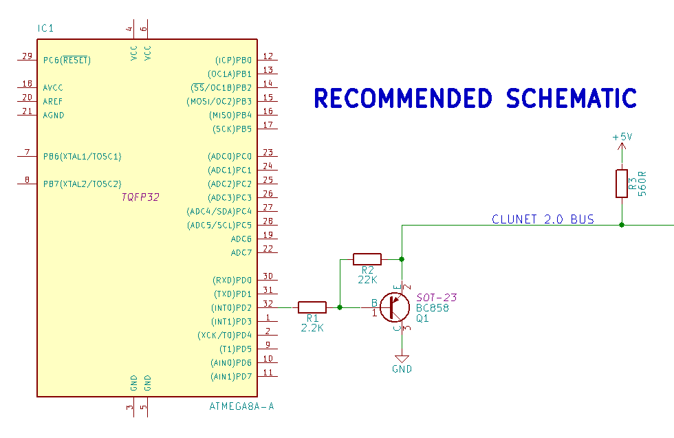
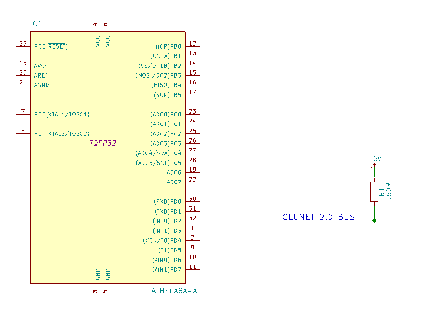

# CLUNET 2.0
Простой протокол передачи данных **CLUNET 2.0** основан на [оригинальном протоколе](https://github.com/ClusterM/clunet) **Алексея Авдюхина** _aka_ **Cluster**.
## Основные отличия
Ниже приведены основные отличия от оригинальной версии протокола:
 1. Скорость передачи выше от **2 до 4** раз в _зависимости от передаваемых данных_ при том же значении периода передачи (64 мкс).
 2. Нагрузка на центральный процессор снижена за счет более редкого вызова прерываний.
 3. Для работы с сетью используется всего одна нога микроконтроллера (можно применить и в оригинале, надо бы сделать **PullUp**)
 4. Немного изменен программный интерфейс (незначительно), так что использование вместо оригинала повлечет _небольшую_ доработку.

## Особенности и принцип
 1. Протокол передачи использует доминантно-рецессивный принцип, использованный в **CAN**. Все устройства расположены на одной шине и имеют одинаковые права, то есть выделенного мастера нет.
 2. Алгоритм использует _**активную защиту от коллизий**_, проводя арбитраж и отдавая право передачи данных устройству с более высоким приоритетом. Поле приоритета занимает 3 бита, что позволяет назначать 8 уровней приоритета. При равенстве приоритетов поле арбитража расширяется на все тело кадра.
 3. Алгоритм обеспечивает _**синхронизацию по более крутому доминантному сигналу как операции чтения так и передачи**_. Это обеспечивает превосходные результаты как при чтении так и арбитраже на шине при конкурентном активном использовании шины различными устройствами. Устраняет рассинхронизацию между устройствами во время передачи.

## Схемотехника
Шина **CLUNET 2.0** использует для передачи и приема данных _**всего один**_ провод и _**одну ногу**_ микроконтроллера **(должна поддерживать внешние прерывания)**. Организовать и подключиться к ней возможно 2 способами _не изменяя прошивку устройства_:
 1. Используя любой биополярный транзистор **PNP**-типа _**(рекомендуется)**_:

 2. Прямое простое подключение:

